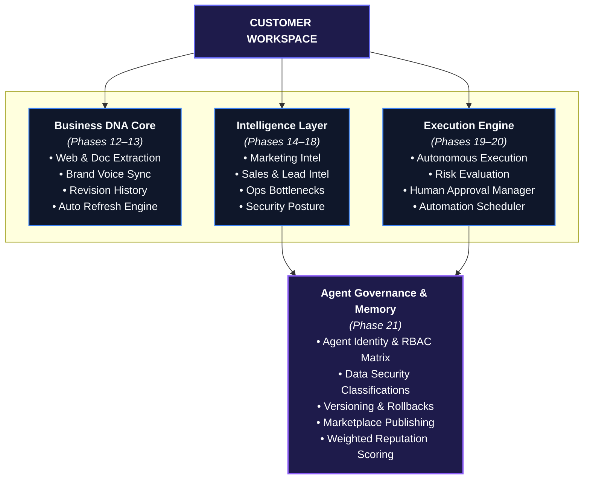

# 🛸 FoundryOS — The Autonomous Business & Revenue Operating System

[](https://www.typescriptlang.org/)
[](#)
[](./tests)
[](#architecture)
[](#)

> **FoundryOS** is the **Autonomous Business & Revenue Operating System**. Powered by continuous, versioned **Business DNA**, a high-converting **Conversational Lead-to-Revenue Suite** (2-Way SMS, 5-Star Reviews, Text-to-Pay, Missed-Call Auto-Text), and backed by the **Hyperion Engine** multi-agent runtime, FoundryOS autonomously acquires leads, nurtures clients, generates websites/apps, and powers multi-tenant business operations.

---

## 🌟 Key Architecture & Stack



---

## 🚀 Key Features

### 🧬 1. Business DNA & Knowledge Core
- **Continuous Signal Ingestion**: Crawls company websites and imports documents to build a unified Business DNA graph.
- **Brand Voice Alignment**: Enforces company identity, value propositions, positioning, and visual guidelines.
- **Continuous Knowledge Refresh**: Automatic change-detection triggers DNA revisions with audit trails.

### 🧠 2. Multi-Domain Intelligence Layer
- **Marketing Intelligence**: Multi-channel campaign strategies, content calendar generation, and positioning optimization.
- **Sales & Customer Intelligence**: Opportunity detection, lead qualification scoring, and next-best-action routing.
- **Operations Intelligence**: Bottleneck analysis, process optimization, and resource efficiency insights.
- **Security Intelligence**: Zero-Trust posture evaluation, risk detection across 6 risk vectors, and TACF policy enforcement.
- **Intelligence Analytics & Learning**: Unified business maturity scoring (`FOUNDATION` → `AUTONOMOUS`) with memory write-backs.

### ⚡ 3. Autonomous Execution & Customer Automation
- **Risk-Evaluated Execution**: Workflow engine evaluates execution risk (`LOW`, `MEDIUM`, `HIGH`, `CRITICAL`).
- **Human Approval Manager**: `LOW` risk auto-executes; `HIGH` and `CRITICAL` risk hard-halt for human approval sign-off.
- **Automation Scheduler**: Manages cron trigger schedules with state progression (`WAITING` → `TRIGGERED` → `EXECUTING` → `COMPLETED`).
- **Workflow Marketplace**: 8 pre-built templates plus customer workflow builder & versioning engine.

### 🛡️ 4. Enterprise Agent Governance
- **Agent Identity Registry**: Bootstraps 8 core system agents (`@brand`, `@content`, `@publishing`, `@website`, `@security`, `@analytics`, `@learning`, `@lead`).
- **Granular RBAC Permission Matrix**: 12 permission actions mapped across 4 data security classification levels (`PUBLIC`, `INTERNAL`, `CONFIDENTIAL`, `RESTRICTED`).
- **Automation Versioning & Rollbacks**: `v1`, `v2`, `v3` snapshot tracking with pre-flight migration safety checks and atomic rollbacks.
- **Marketplace Publishing**: Package submission, review/approval workflow, and single-click customer installation.
- **Weighted Reputation Scoring**: Real-time performance tracking (0-100) with badging (`EXCELLENT`, `GOOD`, `NEEDS_IMPROVEMENT`, `CRITICAL_RISK`).

---

## 🛠️ Verification & Test Suite

The platform is fully verified with **159 passing tests across 48 test files** and 0 TypeScript compilation errors.

### Type Check
```bash
npm run typecheck
```

### Run Test Suite
```bash
npx tsx --test src/**/*.test.ts tests/e2e/*.test.ts tests/hardening/*.test.ts
```

---

## 📖 Product Documentation

For the complete product architecture, API schemas, governance matrix, and operational launch guide, see [WIKI.md](./WIKI.md).
