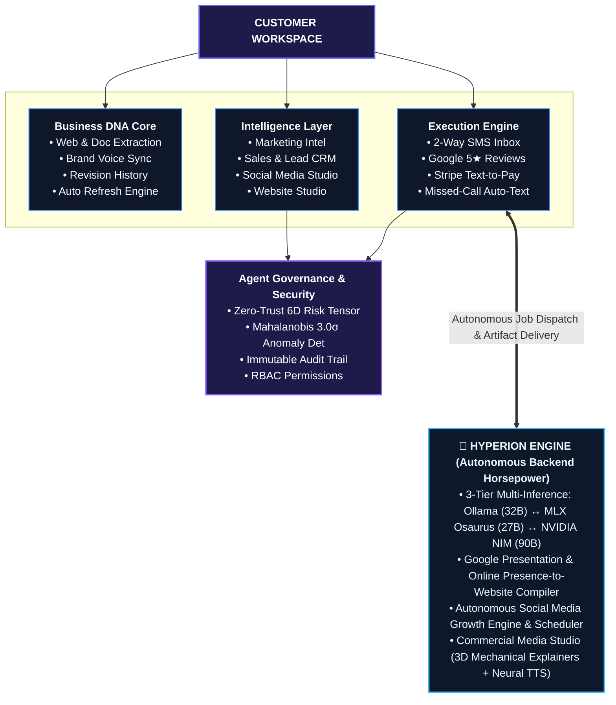

# 🛸 FoundryOS — The Autonomous Business & Revenue Operating System

[](https://www.typescriptlang.org/)
[](#)
[](./tests)
[](#architecture)
[](#)

> **FoundryOS** is the **Autonomous Business & Revenue Operating System**. Powered by continuous, versioned **Business DNA**, a high-converting **Conversational Lead-to-Revenue Suite** (2-Way SMS, 5-Star Reviews, Text-to-Pay, Missed-Call Auto-Text), a **Google Presentation & Deck-to-Fortune 500 Website Compiler**, and an **Autonomous Social Media Growth Engine**, FoundryOS autonomously acquires leads, nurtures clients, generates websites/apps, and powers multi-tenant business operations.

---

## 🏛️ Platform Architecture & Pipeline



---

## 💰 Subscription Tiers & Pricing Matrix

| Subscription Plan | Monthly Retainer | Included Features | Ideal Client |
| :--- | :--- | :--- | :--- |
| **🥉 Starter** | **$497 / mo** | 2-Way Omnichannel Inbox, Google 5★ Review Multiplier, Missed-Call Auto-Text, Stripe Text-to-Pay, 1,000 SMS/mo | Local service contractors & single-trade operators |
| **🥈 Growth (Pro)** | **$997 / mo** | Everything in Starter + Living Business DNA Core, AI Branding Center, Website Studio with Deck Ingest, Autonomous Lead CRM, 3,500 SMS/mo | Multi-trade commercial operators & growing practices |
| **🥇 Enterprise KaaS** | **$2,497 / mo** | Everything in Growth + Master Multi-Tenant Control Plane, 3-Tier Multi-Inference, Zero-Trust 6D Risk Tensor Security, 10,000 SMS/mo | Multi-location enterprises, franchises, and regional contractors |

### 🚀 High-Margin Add-On Services:
* **📱 Autonomous Social Media & Brand Voice Engine:** `$997 / mo` (3x weekly branded posts, profile provisioning kit, interactive visual calendar scheduler, LinkedIn/X/IG/FB/GMB live previews).
* **🌐 Fortune 500 Dynamic Web Infrastructure:** `$2,500 Setup + $250 / mo Hosting` (Google Presentation / Deck & local footprint ingestion, sub-15s booking widget, interactive ROI calculator).
* **🎬 Commercial Media & 3D Explainer Studio:** `$1,500 / campaign` (3D mechanical explainers, Kokoro neural voiceovers, 4K video ads).

👉 *Full pricing specification:* [**docs/FOUNDRYOS_PRICING_AND_REVENUE_MATRIX.md**](./docs/FOUNDRYOS_PRICING_AND_REVENUE_MATRIX.md)

---

## 📦 Complete Module Directory (18 Modules)

1. **📬 Unified Inbox (`/inbox`)**: 2-Way SMS, WebChat-to-Text, Google Local Services, and contractor equipment telemetry drawer.
2. **⭐ Reputation & Reviews (`/reviews`)**: 1-Tap Google review requests with AI Brand Voice auto-responses.
3. **💳 Text-to-Pay (`/payments`)**: Stripe 1-tap SMS invoice links with automated payment receipts.
4. **🧬 Business DNA OS (`/customer_intelligence`)**: Living single source of truth across Marketing, Sales, Operations, and Security.
5. **🏷️ Services Catalog (`/services`)**: Transformation blueprints and recurring retainer packages.
6. **🚀 AI Branding Center (`/branding`)**: 3-tier resilient brand positioning guide and tagline synthesizer.
7. **🔥 SMS Campaigns (`/campaigns`)**: Targeted promotional SMS blasts with 98% open rates.
8. **📞 Virtual Phones (`/phones`)**: Sub-15s missed-call auto-text response engine.
9. **🌐 Website Studio (`/studio`)**: Ingests Google Presentations, slide decks, or local presence into Fortune 500 websites.
10. **📱 Social Media Studio (`/social`)**: Multi-platform profile setup kit, weekly AI brand voice posts, visual calendar & scheduler.
11. **📋 Projects (`/projects`)**: Project governance, milestone tracking, and budget burn charts.
12. **⚡ Leads CRM (`/leads`)**: Autonomous AI prospector quantifying 3 Opportunity Pillars.
13. **📈 Analytics (`/analytics`)**: Departmental capacity forecasting and bottleneck risk remediation.
14. **📊 Reports (`/reports`)**: Financial revenue forecasts and exportable executive summaries.
15. **👥 Users & Teams (`/users`)**: High-contrast user directory with `#EM-1001` ID tags and RBAC roles.
16. **🛡️ Audit Trail (`/audit`)**: Immutable chronological compliance and security event ledger.
17. **⚙️ Settings (`/settings`)**: Fortune 500 Enterprise KaaS Control Matrix with 5 tabs.
18. **👑 Master Admin (`/master_admin`)**: Global tenant control plane for super-administrators.

👉 *Full architecture manual:* [**docs/FOUNDRYOS_MASTER_ARCHITECTURE.md**](./docs/FOUNDRYOS_MASTER_ARCHITECTURE.md)

---

## 🚢 Quickstart & Deployment

### Run Locally (Port 5174):
```bash
npm install
npm run dev -- --port 5174 --host 127.0.0.1
```

### Deploy to Production VPS in 1 Click:
```bash
curl -sSL https://raw.githubusercontent.com/FinesseJones/FoundryOS/main/deploy-vps.sh | bash
```

---

## 🛠️ Verification & Test Suite
```bash
npm run typecheck
npx tsx --test src/**/*.test.ts tests/e2e/*.test.ts
npm run build
```
